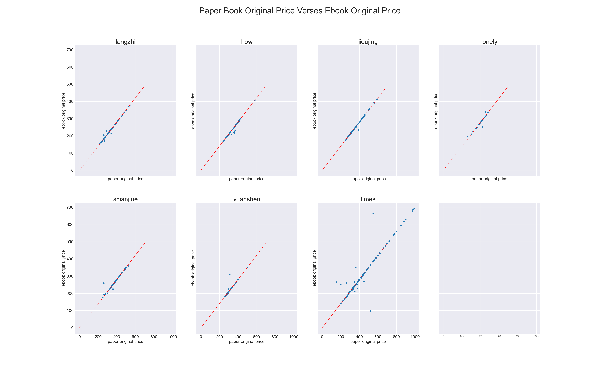

# 博客來書籍資料收集

## 排行榜資料

---
### 類別代號

| 編號 | 類別        |
|----|------------|
| 1  | 文學小說     |
| 2  | 商業理財     |
| 3  | 藝術設計     |
| 4  | 人文社科     |
| 6  | 自然科普     |
| 7  | 心理勵志     |
| 8  | 醫療保健     |
| 9  | 飲食        |
| 10 | 生活風格     |
| 11 | 旅遊        |
| 12 | 宗教命理     |
| 13 | 親子教養     |
| 14 | 青少年文學    |
| 15 | 輕小說       |
| 16 | 漫畫、圖文書  |
### 爬取排行榜資料
- `topsales.py`:依類別爬取博客來的銷售排行榜，並將其依序儲存至`topSales`, 
`preSales`, `newSales`資料夾中。
- `mergeToCsv.py`:將`topSales`, `preSales`, `newSales`資料夾中的資料合併成 csv 檔，於
`./data`資料夾中。
- `topsalesbookdata.py`:搜尋`./Datedata`中資料加入其書籍的出版日期與出版社等資料，並儲存至`./book_info`資料夾中。
- `addDate.py`:將`./data`資料夾中的加上日期欄位，並透過`book_info`中獲得個書籍對應的出版社與出版日期，並儲存至`./Datedata`資料夾中。
### 爬取資料檔案
- `topSales`: 依類別爬取的每日銷售排行榜資料，包含書籍名稱、作者、價格與其類別中的排名資料。
- `preSales`: 依類別爬取的每日預購排行榜資料，包含書籍名稱、作者、價格與其類別中的排名資料。
- `newSales`: 依類別爬取的每日新書排行榜資料，包含書籍名稱、作者、價格與其類別中的排名資料。
- `./data`: 合併`topSales`,`preSales`,`newSales`的資料，並紀錄下載時間，清理價格資料為售價與打折數。
- `./Datedata`: 加上出版日期欄位以及出版社欄位的排行榜資料，所有欄位為對應如下：

  | 代號          | 中文       |
  |-------------|----------|
  | attr        | 七日榜或十四日榜 |
  | cate        | 類別       |
  | rank        | 排名       |
  | title       | 標題       |
  | author      | 作者       |
  | price       | 販售價格     |
  | page        | 頁數       |
  | date        | 日期       |
  | type        | 類型       |
  | discount    | 折扣       |
  | price_      | 原始價格     |
  | publisher   | 出版社      |
  | publishDate | 出版日期     |

### 分析結果
- 主要使用`dateData`中的資料以`topsalesAnalysis.py`進行分析，結果儲存至`pic`資料夾中。
- 從以下圖表可以看出，博客來中書商的打折策略與書籍的發行日期、原始價格和排名無關，大多的折數維持在79折左右。

- 而在各分類中此一趨勢也並未有太多改變

## 出版社資料

---

### 出版社代號對照
| 英文      | 中文   |
|-----------|--------|
| fangzhi   | 方智   |
| how       | 如何   |
| jioujing  | 究竟   |
| lonely    | 寂寞   |
| shianjiue | 先覺   |
| yuanshen  | 圓神   |
| times     | 時報   |

### 爬取出版社程式
- `publisher.py`:爬取博客來的出版社資料，並儲存至`publisher`資料夾中。
### 爬取資料檔案
  - `publisher`: 爬取個出版社的書籍資料，包含資料內容如下：

    | 代號               |        |
    |------------------|------------|
    | title            | 標題       |
    | author           | 作者       |
    | publisher        | 出版社     |
    | publication_date | 出版日期   |
    | discount         | 折扣       |
    | price            | 價格       |

### 分析結果
- 主要使用`publisher`中的資料以`publisherAnalysis.py`進行分析，結果儲存至`pic`資料夾中。
- 在這份資料中，紙本書的部分依然是維持以79折為主，並且出版日期與原始價格對於其折數皆無明顯影響。

- 而在電子書與紙本書的部分可以發現其電子書的定價基本上固定為紙本書的79折，並且其出版日期與原始價格對於其折數皆無明顯影響。
  

- 同時，在進行打折時紙本書與電子書之間不會特別參照對方的折數進行打折，因此會出現部分電子書售價高於紙本書售價的現象。

